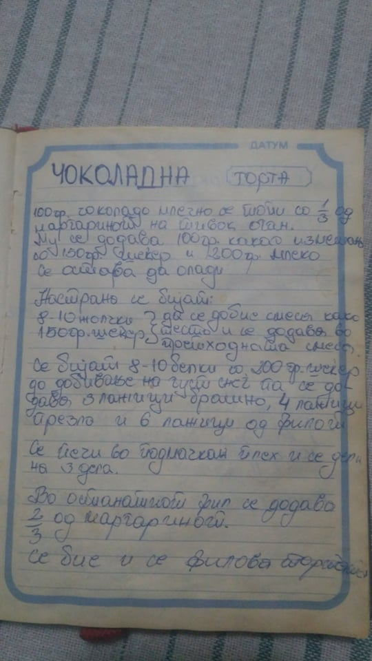
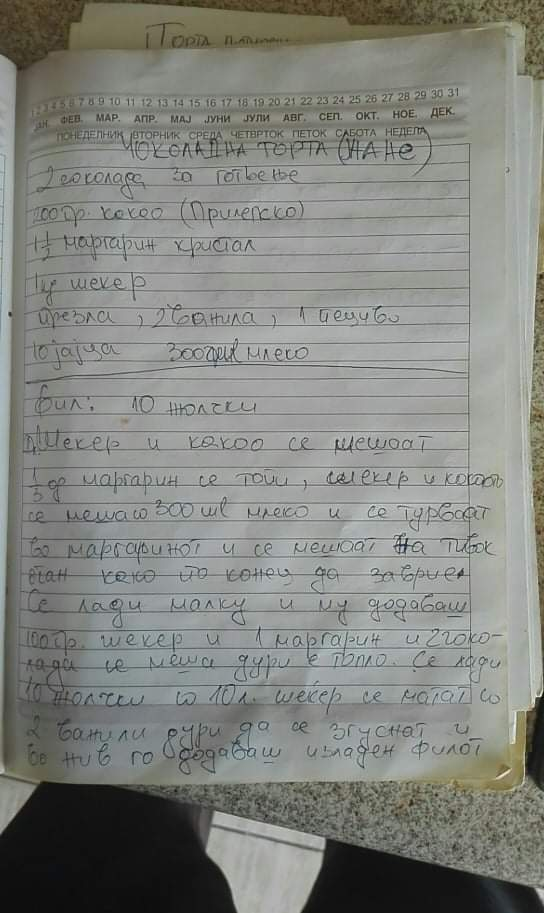
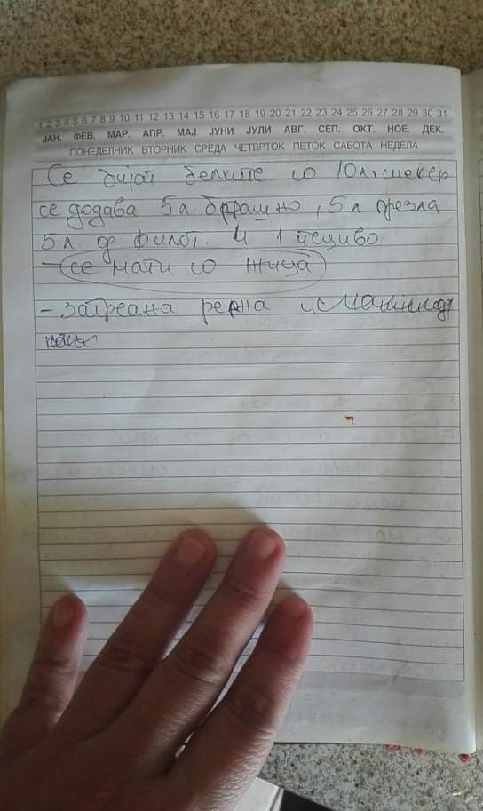

# # Чоколадна торта

### Состојки:

- [ ] 100 гр. чоколадо за готвење

- [ ] 100 гр. Какао (Витаминка)

- [ ] 1 Кристал маргарин

- [ ] 500 гр. шеќер

- [ ] 2. 5супени лажици презла

- [ ] 2. 5супени лажици брашно

- [ ] 1 ќесички ванилин шеќер

- [ ] пола ќесичка пециво

- [ ] 5 јајца

- [ ] 100 мл. млеко

### Подготовка

#### Фил

100 гр. какао се меша со 10 супени лажици шеќер. Откако ќе се измешаат се додава 100 мл. млеко и се меша. Се става на оган малку масло и пола маргарин кристал. Се меша додека не се стопи маргаринот. Потоа се додаваат шеќерот, какаото и млекото. Потоа се додава едно чоколадо за готвење и се меша додека не се стопи.

Во друг сад, се одделуваат 5 жолчки, се матат со миксер и при матењето се додава 5 супени лажици шеќер и 1 ќесичка ванилин шеќер, се мати додека не се стопи шеќерот. На крај се додаваат жолчките со шеќерот во чоколадната смеса и се матат со миксер додека смесата не стане еднородна.

#### Пандишпања

Се матат 5 белки со 5 супени лажици шеќер. Се додаваат 2.5 супени лажици брашно, 2.5 супени лажици презла, 2.5 лажици од филот и пола пециво. Се мати со жица.

### Добар апетит!

## (Верзија 1)

Ова е првата верзија на тортата што ја пробавме. Пандишпањата беше неуспешна.

---

### Состојки:

- [ ] 100 гр. Млечно Чоколадо
- [ ] 250 гр. Маргарин
- [ ] 100 гр. Какао
- [ ] 500 гр. Шеќер
- [ ] 200 мл. Млеко
- [ ] 8-10 Јајца
- [ ] 3 Лажици брашно
- [ ] 4 Лажици презла

### Подготовка:

#### Фил:

1. 100 грама млечно чоколадо се топи со $\frac{1}{3}$ од маргаринот на тивок оган.
   
   - Се дододава 100 грама Какао измешано со 150 грама шеќер и 200 грама млеко.
   - Се остава да олади.

2. Се матат 8-10 жолчки со 150 гр. шеќер додека не се добие смеса како тесто.
   
   - Се додава смесата од чекор 1.

3. Се матат 8-10 белки со 200 грама шеќер се додека не се добие густ снег.
   
   - Се додаваат 3 лажици брашно, 4 лажици презла и 6 лажици од филот добиен од чекор 2. 

4. Се пече во подмачкан плех и се дели на 3 дела.

5. Во останатиот дел од филот добиен во чекор 2 се додава $\frac{2}{3}$ од маргаринот и се меша.

6. Филот се додава на пандишпанот.

---

## Верзија 2

Комшивката на Вики ја прашала баба и на Вики

---

### Состојки

- [ ] 2x100 гр. чоколадо за готвење

- [ ] 200 гр. Какао (Витаминка)

- [ ] $1 \frac{1}{2}$ Кристал маргарин

- [ ] 1 кг. шеќер

- [ ] Презла

- [ ] 2 ќесички ванилин шеќер

- [ ] 1 ќесичка пециво

- [ ] 10 јајца

- [ ] 300 гр. млеко

### Подготовка:

#### Фил:

20 супени лажици шеќер и 200 гр. какао се мешаат. Се топи $\frac{1}{3}$ од маргаринот. Шеќерот и какаото се мешаат со 300 мл. млеко и се додаваат во стопениот маргарин. Се мешаат на тивок оган додека не зоврие. Се лади малку и се додава 100 гр. шеќер, еден маргарин и двете чоколади додека е топло.

Во посебен сад се матат 10 жолчки со 10 супени лажици шеќер и 2 ќесички ванилин шеќер додека не се згуснат.  Во смесата се додава изладениот фил.

#### Пандишпања:

Се матат 10 белки со 10 супени лажици шеќер. Се додаваат 5 супени лажици брашно, 5 супени лажици презла, 5 лажици од филот и едно пециво. Се мати со жица.

## Верзија 3

Вики по сеќавање од баба и.

### Подготовка

#### Фил

100 гр. какао се меша со 10 супени лажици шеќер. Откако ќе се измешаат се додава 100 мл. млеко и се меша. Се става на оган и малку масло и пола маргарин кристал. Се меша додека не се стопи маргаринот. Потоа се додава едно чоколадо за готвење и се меша додека не се стопи.

Во друг сад, се одделуваат 5 жолчки, се матат со миксер и при матењето се додава <s>10 </s> 5 супени лажици шеќер, се мати додека не се стопи шеќерот. На крај се додаваат жолчките со шеќерот во чоколадната смеса и се матат со миксер додека смесата не стане еднородна.